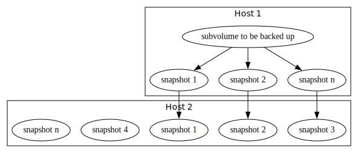

# backup-local-rs

A simple script to coordinate local backups.

## User Story

As a user, I want backups of all the files in my home directory to be made automatically every 30 minutes so that I don't have to worry about loosing data.

## Requirements

ID | Description | Priority
---|---|---
01 | The system must be able to make a backup of all files every 30 minutes. | Mandatory
02 | The system must provide meaningful error reports to the user. | Mandatory
03 | The system should provide status information to the user. | Optional
04 | The system should provide the user the ability to exclude selected files. | Optional
05 | The system must be able to run computers based on x86 (64bit) and ARMv6 (32bit hf) architectures running Linux. | Mandatory

## Technical Specification

The system will be written in Rust.
It will use the btrfs tools for making the backup.
Execution of the system will be triggered by systemd.

## Architecture

The system involves two hosts:
* host 1: the host having the subvolume that should be backed up
* host 2: the host that will store the backups

First a snapshot of the subvolume will be created on host 1.
The snapshot will then be transferred to host 2.
If host 2 already contains a suitable parent snapshot, an incremental transfer will be made.
Otherwise, a complete transfer will be made.
Finally, the retention policies for snapshots will be applied to both hosts.
Typically, only a few recent snapshots will be kept on host 1, while host 2 keeps snapshots for a longer time.



## Deployment

The program can be installed via cargo from the GitHub repository.

```bash
cargo install --git https://github.com/hannes-hochreiner/backup-local-rs
```

For each release, an rpm package is prepared using [OBS](https://build.opensuse.org/package/show/home:h0h4/backup-local-rs).

## License

This work is licensed under the MIT or Apache 2.0 license.

`SPDX-License-Identifier: MIT OR Apache-2.0`